# txgen

> Generate training data for scene text recognition

## Installation

```
npm i txgen (-g for global install)
```

## CLI example 1

500 character images based on regex pattern `[0-9A-NP-Z#]` with size `64x64` pixels and a padding of `4` pixels. Backgrounds come from directory `./backgrounds`, fonts come from directory `./fonts`. The output should be placed in directory `./chars-train` and with the `-d` option files are placed in a directory with the name of the character and incremental file name (e.g., A/1.jpg, A/2.jpg, ...).

```bash
txgen -b ./backgrounds -f ./fonts -o ./chars-train -p "[0-9A-NP-Z#]" --number 500 -w 64 -h 64 -a 4 -d
```

## CLI example 2

Similar to the above example, but with a different regex and no specified width (width is dynamically calculated based on length of generated text). The files are placed inside the output folder `./serial-numbers`.

```bash
txgen -b ./backgrounds -f ./fonts -o ./serial-numbers -p "[A-NP-Z0-9#][A-NP-Z0-9\-]{2,10}[A-NP-Z0-9]?" --number 500 -h 64 -a 10 -d
```

## CLI Options

| Option | Description | Required |
| --- | --- | --- |
| `-b` | Path to directory with background image files | ✓ |
| `-f` | path to directory with .ttf font files (e.g., downloaded from [dafont](https://www.dafont.com)) | ✓ |
| `-o` | Output directory of generated files | |
| `-t` | A text string which should be generated | |
| `-a` | Padding in pixels between image border and generated text | |
| `-p` | A regex pattern which defines strings to be generated (use either `-t` or `-p`) | |
| `-n` | The total number of output images which should be generated | |
| `-s` | The font size which should be used in pixels | |
| `-w` | The width of the output image in pixels | |
| `-h` | The height of the output image in pixels | |
| `-d` | The generated output should be placed in directories with text/pattern name and incremental filenames | |

# Examples

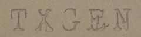
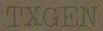
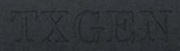
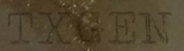
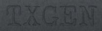
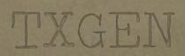
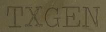
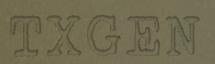
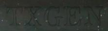
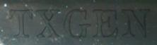

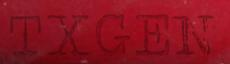
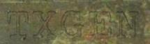
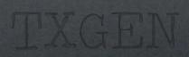

